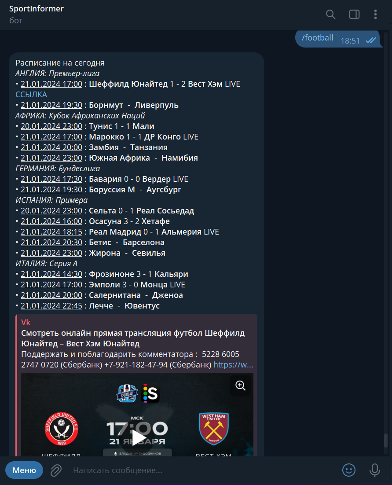
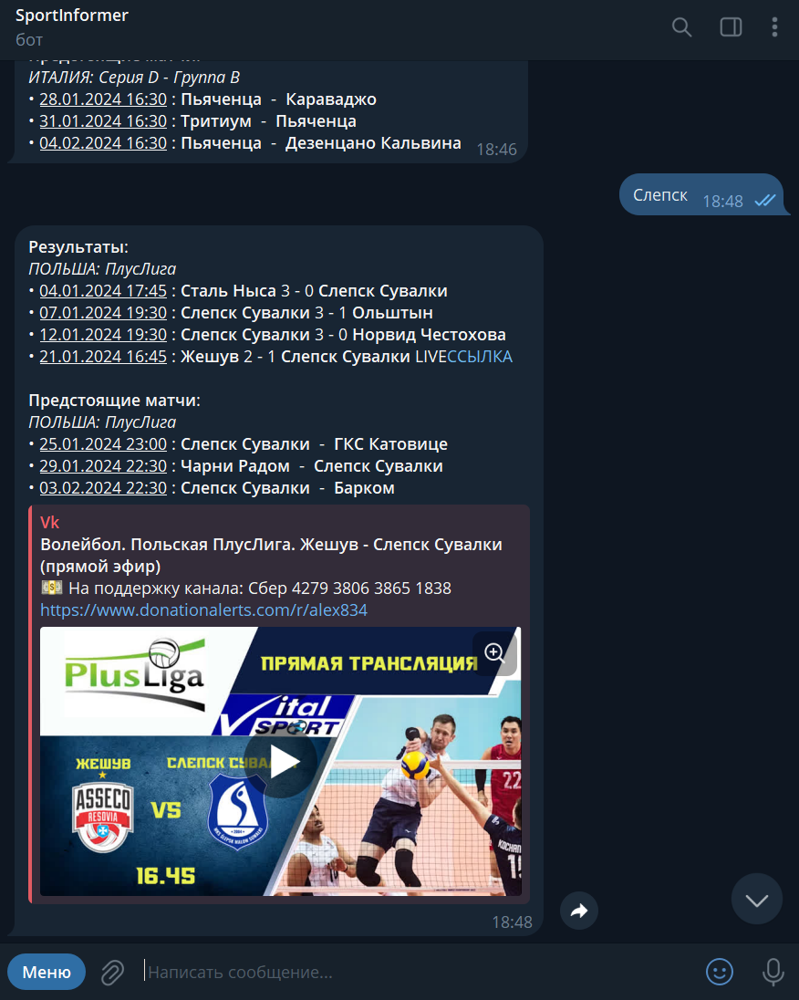

# Sport Informer

## Описание проекта
Sport Informer - это телеграмм бот, разработанный на языке программирования Python с использованием библиотеки aiogram. Бот предоставляет пользователю информацию о спортивных событиях, включая расписание, результаты команд и спортсменов, а также ссылки на трансляции.

## Технологический стек
- **Язык программирования:** Python
- **Бот:** aiogram
- **Парсинг:** Используется для получения статистики с сайта flashscore.
- **Трансляции:** Интеграция с VK API для получения ссылок на трансляции.
- **Базы данных:** Redis
- **Контейниризация:** Использование docker

## Установка
1. Клонируйте репозиторий: `git clone https://github.com/artm44/SportInformer.git`
2. Создайте виртуальное окружение: `python -m venv venv`
3. Активируйте виртуальное окружение:
- На Windows: `venv\Scripts\activate`
- На Linux/Mac: `source venv/bin/activate`
4. Установите зависимости: `pip install -r requirements.txt`
5. Создайте файл `.env` с токенами Телеграмма и ВКонтакте
6. Запустите Redis. Например, при помощи Docker `docker run -p 127.0.0.1:6379:6379 redis:latest`
7. Запустите бот: `python main.py`

## Запуск в Docker

To run the server on a Docker container, please execute the following from the root directory:

```bash
docker-compose up
```

## Функциональности
1. **Расписание событий:** Получение актуального расписания спортивных событий.
2. **Результаты команд и спортсменов:** Запрос результатов для конкретной команды или спортсмена.
3. **Трансляции:** Получение ссылок на трансляции с использованием VK API.

## Скриншоты

*Пример запроса расписания и получения ответа от бота*


*Пример запроса результатов команды и получения ответа от бота*

## Лицензия
Этот проект лицензирован в соответствии с условиями [MIT License](LICENSE).
